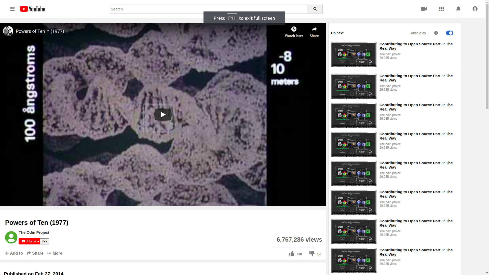

# YouTube Webpage

> The goal of this project was to focus on making the media elements show up. We worked on embedding the YouTube video player into the page so it actually plays and showing little thumbnail images along the right side.

## Built With

- HTML5
- CSS
- Font Awesome

## Live Demo

[Live Demo Link](https://antonyotero.github.io/youtube-webpage/)

## Authors

👤 **Ahmed Amin**

- GitHub: [@githubhandle](https://github.com/AhmedAmin90)

👤 **Antony Otero**

- GitHub: [@githubhandle](https://github.com/AntonyOtero)

## 🤝 Contributing

Contributions, issues, and feature requests are welcome!

Feel free to check the [issues page](issues/).

## Show your support

Give a ⭐️ if you like this project!

## 📝 License

This project is [MIT](lic.url) licensed.
